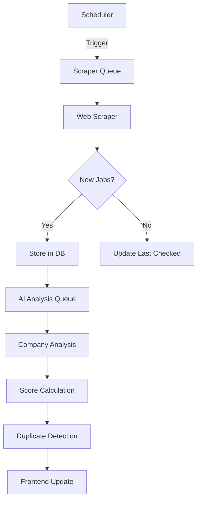
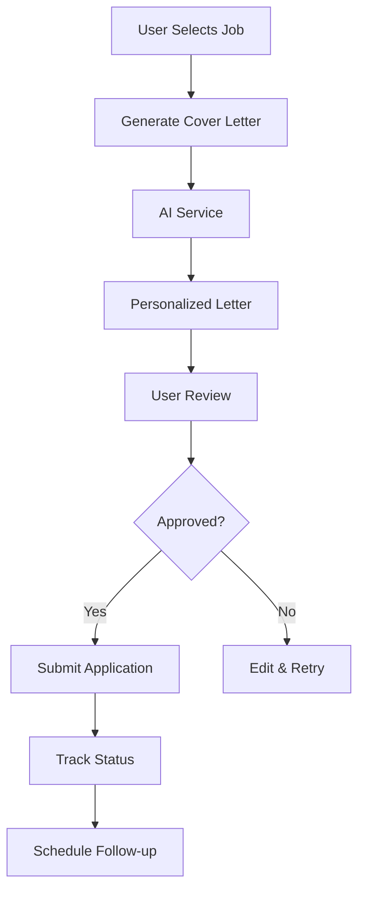

# TalentRadar Architecture

## Overview

TalentRadar is built as a monorepo with modular architecture, designed for scalability and maintainability. The system is event-driven with background job processing for scraping and AI analysis.

## System Architecture

```
┌─────────────────┐    ┌─────────────────┐    ┌─────────────────┐
│   Frontend      │    │   Backend API   │    │  Background     │
│   (Next.js)     │◄──►│   (NestJS)      │◄──►│  Workers        │
│                 │    │                 │    │  (BullMQ)       │
└─────────────────┘    └─────────────────┘    └─────────────────┘
         │                       │                       │
         │                       │                       │
         ▼                       ▼                       ▼
┌─────────────────┐    ┌─────────────────┐    ┌─────────────────┐
│   Redis Cache   │    │  PostgreSQL     │    │  External APIs  │
│   (Session)     │    │  (Primary DB)   │    │  (AI, Scraping) │
└─────────────────┘    └─────────────────┘    └─────────────────┘
```

## Core Components

### 1. Frontend Application (Next.js)

**Location**: `apps/web/`

**Responsibilities**:
- User interface for job management
- Dashboard with analytics and insights
- CV and cover letter management
- Application tracking

**Key Features**:
- Server-side rendering for SEO
- Real-time updates via WebSocket
- Responsive design with TailwindCSS
- Component library with shadcn/ui

**Folder Structure**:
```
apps/web/
├── app/                    # App Router pages
│   ├── dashboard/
│   ├── jobs/
│   ├── companies/
│   ├── applications/
│   └── settings/
├── components/             # Reusable UI components
│   ├── ui/                # Base UI components
│   ├── forms/             # Form components
│   ├── charts/            # Data visualization
│   └── layout/            # Layout components
└── lib/                   # Utilities and configurations
    ├── api.ts             # API client
    ├── utils.ts           # Helper functions
    └── validations.ts     # Form validation schemas
```

### 2. Backend API (NestJS)

**Location**: `apps/api/`

**Responsibilities**:
- REST API endpoints
- Authentication and authorization
- Business logic coordination
- Job queue management
- WebSocket for real-time updates

**Architecture Pattern**: Domain-driven design with modules

**Folder Structure**:
```
apps/api/src/
├── modules/
│   ├── vacancy/           # Job vacancy management
│   ├── company/           # Company information
│   ├── scraper/           # Web scraping coordination
│   ├── ai/                # AI service integration
│   ├── cv/                # CV management and improvement
│   ├── scoring/           # Job scoring algorithms
│   ├── application/       # Job application tracking
│   └── auth/              # Authentication (future)
├── common/                # Shared utilities
│   ├── decorators/
│   ├── filters/
│   ├── guards/
│   ├── interceptors/
│   └── pipes/
└── config/                # Configuration management
    ├── database.config.ts
    ├── redis.config.ts
    └── ai.config.ts
```

### 3. Background Workers

**Responsibilities**:
- Scheduled job scraping
- AI-powered company analysis
- Email notifications
- Data processing and cleanup

**Queue Types**:
- **Scraping Queue**: Regular job site monitoring
- **AI Queue**: Company analysis and content generation
- **Notification Queue**: Email and push notifications
- **Maintenance Queue**: Data cleanup and optimization

### 4. Database Design

**Primary Database**: PostgreSQL

**Key Entities**:

```sql
-- Job Sources
job_sources (
  id, name, url, type, countries, 
  technologies, scrape_frequency, status
)

-- Companies
companies (
  id, name, website, size, industry,
  culture_score, retention_rate, hiring_process
)

-- Vacancies
vacancies (
  id, company_id, source_id, title, description,
  requirements, salary_min, salary_max, location,
  tech_stack, score, status, scraped_at
)

-- CVs
cvs (
  id, name, content, skills, experience,
  ai_suggestions, version, created_at
)

-- Applications
applications (
  id, vacancy_id, cv_id, cover_letter,
  status, applied_at, follow_up_date
)
```

**Indexes and Performance**:
- Full-text search on vacancy descriptions
- Composite indexes on location + tech_stack
- Partitioning on large tables by date

### 5. AI Integration

**Provider**: OpenRouter API (multi-model access)

**AI Workflows**:

1. **Company Analysis**:
   ```typescript
   interface CompanyAnalysis {
     size: 'startup' | 'scale-up' | 'enterprise';
     culture: CultureMetrics;
     techStack: string[];
     hiringProcess: ProcessStep[];
     salaryRange: SalaryEstimate;
   }
   ```

2. **CV Improvement**:
   ```typescript
   interface CVImprovement {
     suggestions: Suggestion[];
     optimizedContent: string;
     skillsGaps: string[];
     matchScore: number;
   }
   ```

3. **Cover Letter Generation**:
   ```typescript
   interface CoverLetterRequest {
     vacancy: Vacancy;
     company: Company;
     cv: CV;
     personalizations: string[];
   }
   ```

### 6. Web Scraping Engine

**Technology**: Playwright for dynamic content

**Scraping Strategies**:

1. **LinkedIn Jobs**: API-based scraping with rate limiting
2. **Company Career Pages**: DOM parsing with CSS selectors
3. **Job Boards**: RSS feeds where available, DOM parsing otherwise

**Anti-Detection Measures**:
- Rotating user agents and headers
- Random delays between requests
- Proxy rotation (production)
- Browser fingerprint randomization

**Error Handling**:
- Retry logic with exponential backoff
- Dead letter queues for failed jobs
- Alert system for consistent failures

## Data Flow

### Job Discovery Flow



### Application Flow



## Security Considerations

### Data Protection
- Encryption at rest for sensitive data
- API key management via environment variables
- Rate limiting on all public endpoints
- Input validation and sanitization

### Scraping Ethics
- Respect robots.txt files
- Implement reasonable rate limiting
- User-agent identification
- Terms of service compliance

### AI Data Handling
- No storage of AI API responses
- Anonymized data for model training
- Audit logs for AI service usage

## Performance Optimization

### Caching Strategy
- **Redis**: Session data, API responses, temporary data
- **Database**: Query result caching
- **CDN**: Static assets and images (production)

### Background Processing
- Parallel job processing with BullMQ
- Priority queues for time-sensitive tasks
- Health monitoring and auto-scaling

### Database Optimization
- Connection pooling
- Read replicas for analytics queries
- Automated backup and point-in-time recovery

## Monitoring and Observability

### Metrics Collection
- Application metrics with Prometheus
- Database performance monitoring
- AI service usage and costs
- Scraping success rates

### Logging
- Structured logging with Winston
- Centralized log aggregation
- Error tracking with context

### Alerting
- Failed job notifications
- AI service quota alerts
- Database performance warnings
- Scraping failure alerts

## Deployment Architecture

### Development
```
Docker Compose
├── PostgreSQL container
├── Redis container
├── API container (hot reload)
└── Web container (hot reload)
```

### Production
```
Railway/Fly.io
├── Web app (Next.js)
├── API app (NestJS)
├── PostgreSQL database
├── Redis cache
└── Background workers
```

## Scalability Considerations

### Horizontal Scaling
- Stateless API design
- Worker process scaling
- Database read replicas
- CDN for static content

### Vertical Scaling
- Resource monitoring and alerts
- Automatic scaling triggers
- Cost optimization strategies

## Future Architecture Evolution

### Phase 2 Enhancements
- Microservice extraction for AI processing
- Event streaming with Kafka
- Advanced caching with Redis Cluster

### Phase 3 Vision
- Multi-tenant architecture
- Machine learning pipeline
- Real-time collaboration features
- Mobile API gateway