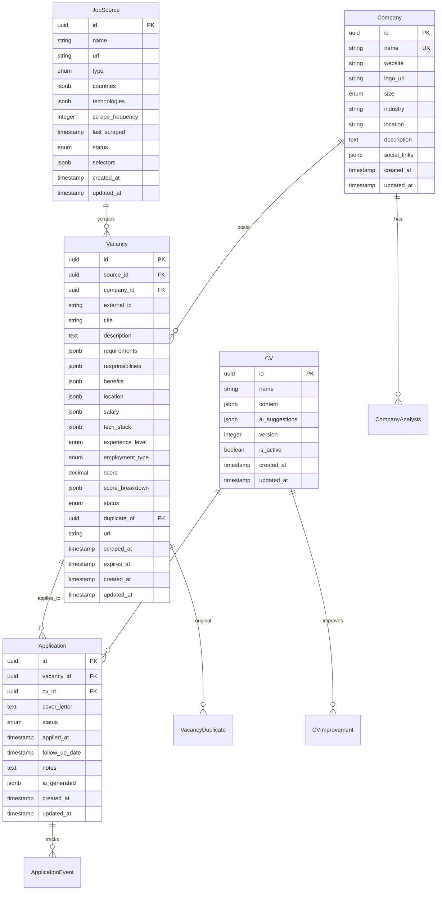

# TalentRadar Data Models

## Database Schema Overview

TalentRadar uses PostgreSQL as the primary database with the following core entities and their relationships:



## Detailed Table Schemas

### job_sources

Stores configuration for job scraping sources.

```sql
CREATE TABLE job_sources (
    id UUID PRIMARY KEY DEFAULT gen_random_uuid(),
    name VARCHAR(255) NOT NULL,
    url TEXT NOT NULL,
    type job_source_type NOT NULL,
    countries JSONB NOT NULL DEFAULT '[]',
    technologies JSONB NOT NULL DEFAULT '[]',
    scrape_frequency INTEGER NOT NULL DEFAULT 24, -- hours
    last_scraped TIMESTAMP WITH TIME ZONE,
    status job_source_status NOT NULL DEFAULT 'active',
    selectors JSONB, -- CSS selectors for scraping
    created_at TIMESTAMP WITH TIME ZONE NOT NULL DEFAULT NOW(),
    updated_at TIMESTAMP WITH TIME ZONE NOT NULL DEFAULT NOW(),
    
    CONSTRAINT unique_source_url UNIQUE(url)
);

CREATE TYPE job_source_type AS ENUM (
    'linkedin', 'company', 'jobboard', 'rss'
);

CREATE TYPE job_source_status AS ENUM (
    'active', 'paused', 'error'
);

-- Indexes
CREATE INDEX idx_job_sources_status ON job_sources(status);
CREATE INDEX idx_job_sources_last_scraped ON job_sources(last_scraped);
CREATE INDEX idx_job_sources_technologies ON job_sources USING GIN(technologies);
```

### companies

Stores company information and metadata.

```sql
CREATE TABLE companies (
    id UUID PRIMARY KEY DEFAULT gen_random_uuid(),
    name VARCHAR(500) NOT NULL,
    website VARCHAR(500),
    logo_url TEXT,
    size company_size,
    industry VARCHAR(200),
    location VARCHAR(200),
    description TEXT,
    social_links JSONB DEFAULT '{}',
    created_at TIMESTAMP WITH TIME ZONE NOT NULL DEFAULT NOW(),
    updated_at TIMESTAMP WITH TIME ZONE NOT NULL DEFAULT NOW(),
    
    CONSTRAINT unique_company_name UNIQUE(name)
);

CREATE TYPE company_size AS ENUM (
    'startup', 'scale-up', 'enterprise'
);

-- Indexes
CREATE INDEX idx_companies_name ON companies(name);
CREATE INDEX idx_companies_industry ON companies(industry);
CREATE INDEX idx_companies_size ON companies(size);
CREATE INDEX idx_companies_location ON companies(location);
```

### company_analyses

Stores AI-generated company analysis data.

```sql
CREATE TABLE company_analyses (
    id UUID PRIMARY KEY DEFAULT gen_random_uuid(),
    company_id UUID NOT NULL REFERENCES companies(id) ON DELETE CASCADE,
    culture_score DECIMAL(3,2) CHECK (culture_score >= 0 AND culture_score <= 10),
    retention_rate DECIMAL(5,2), -- percentage
    hiring_process JSONB DEFAULT '[]',
    tech_stack JSONB DEFAULT '[]',
    work_life_balance DECIMAL(3,2) CHECK (work_life_balance >= 0 AND work_life_balance <= 10),
    career_growth DECIMAL(3,2) CHECK (career_growth >= 0 AND career_growth <= 10),
    salary_competitiveness DECIMAL(3,2) CHECK (salary_competitiveness >= 0 AND salary_competitiveness <= 10),
    benefits_score DECIMAL(3,2) CHECK (benefits_score >= 0 AND benefits_score <= 10),
    analysis_source VARCHAR(100) NOT NULL, -- e.g., 'glassdoor', 'linkedin', 'ai_generated'
    confidence_score DECIMAL(3,2) CHECK (confidence_score >= 0 AND confidence_score <= 1),
    raw_data JSONB, -- Store original analysis data
    created_at TIMESTAMP WITH TIME ZONE NOT NULL DEFAULT NOW(),
    
    CONSTRAINT unique_company_analysis UNIQUE(company_id, analysis_source)
);

-- Indexes
CREATE INDEX idx_company_analyses_company_id ON company_analyses(company_id);
CREATE INDEX idx_company_analyses_culture_score ON company_analyses(culture_score);
CREATE INDEX idx_company_analyses_created_at ON company_analyses(created_at);
```

### vacancies

Stores job vacancy information.

```sql
CREATE TABLE vacancies (
    id UUID PRIMARY KEY DEFAULT gen_random_uuid(),
    source_id UUID NOT NULL REFERENCES job_sources(id) ON DELETE CASCADE,
    company_id UUID NOT NULL REFERENCES companies(id) ON DELETE CASCADE,
    external_id VARCHAR(255), -- ID from the source site
    title VARCHAR(500) NOT NULL,
    description TEXT NOT NULL,
    requirements JSONB DEFAULT '[]',
    responsibilities JSONB DEFAULT '[]',
    benefits JSONB DEFAULT '[]',
    location JSONB NOT NULL, -- {country, city, remote, hybrid}
    salary JSONB, -- {min, max, currency, period}
    tech_stack JSONB DEFAULT '[]',
    experience_level experience_level,
    employment_type employment_type NOT NULL,
    score DECIMAL(5,2) CHECK (score >= 0 AND score <= 100),
    score_breakdown JSONB, -- Detailed scoring components
    status vacancy_status NOT NULL DEFAULT 'active',
    duplicate_of UUID REFERENCES vacancies(id),
    url TEXT NOT NULL,
    scraped_at TIMESTAMP WITH TIME ZONE NOT NULL DEFAULT NOW(),
    expires_at TIMESTAMP WITH TIME ZONE,
    created_at TIMESTAMP WITH TIME ZONE NOT NULL DEFAULT NOW(),
    updated_at TIMESTAMP WITH TIME ZONE NOT NULL DEFAULT NOW(),
    
    CONSTRAINT unique_external_vacancy UNIQUE(source_id, external_id),
    CONSTRAINT valid_salary_range CHECK (
        (salary->>'min')::numeric <= (salary->>'max')::numeric OR 
        (salary->>'min') IS NULL OR 
        (salary->>'max') IS NULL
    )
);

CREATE TYPE experience_level AS ENUM (
    'junior', 'mid', 'senior', 'lead'
);

CREATE TYPE employment_type AS ENUM (
    'full-time', 'part-time', 'contract', 'freelance'
);

CREATE TYPE vacancy_status AS ENUM (
    'active', 'expired', 'filled', 'duplicate'
);

-- Indexes
CREATE INDEX idx_vacancies_company_id ON vacancies(company_id);
CREATE INDEX idx_vacancies_source_id ON vacancies(source_id);
CREATE INDEX idx_vacancies_status ON vacancies(status);
CREATE INDEX idx_vacancies_score ON vacancies(score DESC);
CREATE INDEX idx_vacancies_scraped_at ON vacancies(scraped_at DESC);
CREATE INDEX idx_vacancies_tech_stack ON vacancies USING GIN(tech_stack);
CREATE INDEX idx_vacancies_location ON vacancies USING GIN(location);
CREATE INDEX idx_vacancies_salary ON vacancies USING GIN(salary);

-- Full-text search
CREATE INDEX idx_vacancies_search ON vacancies USING GIN(
    to_tsvector('english', title || ' ' || description)
);
```

### cvs

Stores CV/resume information.

```sql
CREATE TABLE cvs (
    id UUID PRIMARY KEY DEFAULT gen_random_uuid(),
    name VARCHAR(255) NOT NULL,
    content JSONB NOT NULL, -- Full CV structure
    ai_suggestions JSONB, -- AI-generated improvement suggestions
    version INTEGER NOT NULL DEFAULT 1,
    is_active BOOLEAN NOT NULL DEFAULT true,
    created_at TIMESTAMP WITH TIME ZONE NOT NULL DEFAULT NOW(),
    updated_at TIMESTAMP WITH TIME ZONE NOT NULL DEFAULT NOW()
);

-- Indexes
CREATE INDEX idx_cvs_is_active ON cvs(is_active);
CREATE INDEX idx_cvs_created_at ON cvs(created_at DESC);
```

### cv_improvements

Stores AI-generated CV improvement suggestions.

```sql
CREATE TABLE cv_improvements (
    id UUID PRIMARY KEY DEFAULT gen_random_uuid(),
    cv_id UUID NOT NULL REFERENCES cvs(id) ON DELETE CASCADE,
    target_role VARCHAR(255),
    target_company UUID REFERENCES companies(id),
    improvements JSONB NOT NULL, -- Specific improvement suggestions
    missing_skills JSONB DEFAULT '[]',
    strength_areas JSONB DEFAULT '[]',
    match_score DECIMAL(5,2) CHECK (match_score >= 0 AND match_score <= 100),
    ai_model VARCHAR(100) NOT NULL,
    created_at TIMESTAMP WITH TIME ZONE NOT NULL DEFAULT NOW()
);

-- Indexes
CREATE INDEX idx_cv_improvements_cv_id ON cv_improvements(cv_id);
CREATE INDEX idx_cv_improvements_created_at ON cv_improvements(created_at DESC);
```

### applications

Stores job application information.

```sql
CREATE TABLE applications (
    id UUID PRIMARY KEY DEFAULT gen_random_uuid(),
    vacancy_id UUID NOT NULL REFERENCES vacancies(id) ON DELETE CASCADE,
    cv_id UUID NOT NULL REFERENCES cvs(id) ON DELETE RESTRICT,
    cover_letter TEXT,
    status application_status NOT NULL DEFAULT 'draft',
    applied_at TIMESTAMP WITH TIME ZONE,
    follow_up_date TIMESTAMP WITH TIME ZONE,
    notes TEXT,
    ai_generated JSONB DEFAULT '{}', -- AI generation metadata
    created_at TIMESTAMP WITH TIME ZONE NOT NULL DEFAULT NOW(),
    updated_at TIMESTAMP WITH TIME ZONE NOT NULL DEFAULT NOW(),
    
    CONSTRAINT unique_application UNIQUE(vacancy_id, cv_id)
);

CREATE TYPE application_status AS ENUM (
    'draft', 'applied', 'interviewing', 'offered', 'rejected', 'withdrawn'
);

-- Indexes
CREATE INDEX idx_applications_vacancy_id ON applications(vacancy_id);
CREATE INDEX idx_applications_cv_id ON applications(cv_id);
CREATE INDEX idx_applications_status ON applications(status);
CREATE INDEX idx_applications_applied_at ON applications(applied_at DESC);
CREATE INDEX idx_applications_follow_up_date ON applications(follow_up_date);
```

### application_events

Stores timeline events for applications.

```sql
CREATE TABLE application_events (
    id UUID PRIMARY KEY DEFAULT gen_random_uuid(),
    application_id UUID NOT NULL REFERENCES applications(id) ON DELETE CASCADE,
    event_type application_event_type NOT NULL,
    description TEXT NOT NULL,
    event_date TIMESTAMP WITH TIME ZONE NOT NULL,
    notes TEXT,
    metadata JSONB DEFAULT '{}',
    created_at TIMESTAMP WITH TIME ZONE NOT NULL DEFAULT NOW()
);

CREATE TYPE application_event_type AS ENUM (
    'applied', 'response', 'interview', 'offer', 'rejection', 'follow_up', 'withdrawn'
);

-- Indexes
CREATE INDEX idx_application_events_application_id ON application_events(application_id);
CREATE INDEX idx_application_events_event_date ON application_events(event_date DESC);
CREATE INDEX idx_application_events_event_type ON application_events(event_type);
```

### vacancy_duplicates

Tracks duplicate vacancy relationships.

```sql
CREATE TABLE vacancy_duplicates (
    id UUID PRIMARY KEY DEFAULT gen_random_uuid(),
    original_vacancy_id UUID NOT NULL REFERENCES vacancies(id) ON DELETE CASCADE,
    duplicate_vacancy_id UUID NOT NULL REFERENCES vacancies(id) ON DELETE CASCADE,
    similarity_score DECIMAL(5,2) CHECK (similarity_score >= 0 AND similarity_score <= 100),
    detection_method VARCHAR(100) NOT NULL, -- e.g., 'title_match', 'ai_analysis'
    created_at TIMESTAMP WITH TIME ZONE NOT NULL DEFAULT NOW(),
    
    CONSTRAINT unique_duplicate_pair UNIQUE(original_vacancy_id, duplicate_vacancy_id),
    CONSTRAINT no_self_duplicate CHECK (original_vacancy_id != duplicate_vacancy_id)
);

-- Indexes
CREATE INDEX idx_vacancy_duplicates_original ON vacancy_duplicates(original_vacancy_id);
CREATE INDEX idx_vacancy_duplicates_duplicate ON vacancy_duplicates(duplicate_vacancy_id);
```

### scraping_logs

Stores scraping operation logs.

```sql
CREATE TABLE scraping_logs (
    id UUID PRIMARY KEY DEFAULT gen_random_uuid(),
    source_id UUID NOT NULL REFERENCES job_sources(id) ON DELETE CASCADE,
    started_at TIMESTAMP WITH TIME ZONE NOT NULL DEFAULT NOW(),
    completed_at TIMESTAMP WITH TIME ZONE,
    status scraping_status NOT NULL DEFAULT 'running',
    vacancies_found INTEGER DEFAULT 0,
    vacancies_new INTEGER DEFAULT 0,
    vacancies_updated INTEGER DEFAULT 0,
    error_message TEXT,
    metadata JSONB DEFAULT '{}' -- Additional scraping details
);

CREATE TYPE scraping_status AS ENUM (
    'running', 'completed', 'failed', 'cancelled'
);

-- Indexes
CREATE INDEX idx_scraping_logs_source_id ON scraping_logs(source_id);
CREATE INDEX idx_scraping_logs_started_at ON scraping_logs(started_at DESC);
CREATE INDEX idx_scraping_logs_status ON scraping_logs(status);
```

## JSON Schema Definitions

### Vacancy Location
```json
{
  "type": "object",
  "properties": {
    "country": {"type": "string"},
    "city": {"type": "string"},
    "remote": {"type": "boolean"},
    "hybrid": {"type": "boolean"}
  },
  "required": ["country", "remote", "hybrid"]
}
```

### Vacancy Salary
```json
{
  "type": "object",
  "properties": {
    "min": {"type": "number", "minimum": 0},
    "max": {"type": "number", "minimum": 0},
    "currency": {"type": "string", "enum": ["USD", "EUR", "GBP", "CAD"]},
    "period": {"type": "string", "enum": ["hourly", "monthly", "yearly"]}
  },
  "required": ["currency", "period"]
}
```

### CV Content Structure
```json
{
  "type": "object",
  "properties": {
    "personalInfo": {
      "type": "object",
      "properties": {
        "fullName": {"type": "string"},
        "email": {"type": "string", "format": "email"},
        "phone": {"type": "string"},
        "location": {"type": "string"},
        "linkedin": {"type": "string", "format": "uri"},
        "github": {"type": "string", "format": "uri"},
        "website": {"type": "string", "format": "uri"}
      },
      "required": ["fullName", "email", "location"]
    },
    "summary": {"type": "string"},
    "experience": {
      "type": "array",
      "items": {
        "type": "object",
        "properties": {
          "company": {"type": "string"},
          "position": {"type": "string"},
          "startDate": {"type": "string", "format": "date"},
          "endDate": {"type": "string", "format": "date"},
          "current": {"type": "boolean"},
          "description": {"type": "string"},
          "achievements": {"type": "array", "items": {"type": "string"}},
          "technologies": {"type": "array", "items": {"type": "string"}}
        },
        "required": ["company", "position", "startDate", "current", "description"]
      }
    },
    "education": {
      "type": "array",
      "items": {
        "type": "object",
        "properties": {
          "institution": {"type": "string"},
          "degree": {"type": "string"},
          "field": {"type": "string"},
          "startDate": {"type": "string", "format": "date"},
          "endDate": {"type": "string", "format": "date"},
          "gpa": {"type": "number"}
        },
        "required": ["institution", "degree", "field", "startDate"]
      }
    },
    "skills": {
      "type": "object",
      "properties": {
        "technical": {"type": "array", "items": {"type": "string"}},
        "soft": {"type": "array", "items": {"type": "string"}},
        "languages": {
          "type": "array",
          "items": {
            "type": "object",
            "properties": {
              "name": {"type": "string"},
              "level": {"type": "string", "enum": ["basic", "intermediate", "fluent", "native"]}
            },
            "required": ["name", "level"]
          }
        }
      },
      "required": ["technical", "soft", "languages"]
    },
    "projects": {
      "type": "array",
      "items": {
        "type": "object",
        "properties": {
          "name": {"type": "string"},
          "description": {"type": "string"},
          "technologies": {"type": "array", "items": {"type": "string"}},
          "url": {"type": "string", "format": "uri"},
          "githubUrl": {"type": "string", "format": "uri"},
          "startDate": {"type": "string", "format": "date"},
          "endDate": {"type": "string", "format": "date"}
        },
        "required": ["name", "description", "technologies", "startDate"]
      }
    }
  },
  "required": ["personalInfo", "summary", "experience", "skills"]
}
```

## Database Views

### Active Vacancies View
```sql
CREATE VIEW active_vacancies AS
SELECT 
    v.*,
    c.name AS company_name,
    c.size AS company_size,
    c.industry AS company_industry,
    s.name AS source_name,
    s.type AS source_type
FROM vacancies v
JOIN companies c ON v.company_id = c.id
JOIN job_sources s ON v.source_id = s.id
WHERE v.status = 'active'
  AND (v.expires_at IS NULL OR v.expires_at > NOW());
```

### Application Statistics View
```sql
CREATE VIEW application_stats AS
SELECT 
    DATE_TRUNC('week', applied_at) AS week,
    status,
    COUNT(*) AS count
FROM applications
WHERE applied_at IS NOT NULL
GROUP BY DATE_TRUNC('week', applied_at), status
ORDER BY week DESC;
```

## Database Functions

### Calculate Vacancy Score
```sql
CREATE OR REPLACE FUNCTION calculate_vacancy_score(
    vacancy_id UUID,
    preferences JSONB DEFAULT '{}'::JSONB
) RETURNS DECIMAL AS $$
DECLARE
    salary_weight DECIMAL := COALESCE((preferences->>'salaryWeight')::DECIMAL, 0.3);
    tech_weight DECIMAL := COALESCE((preferences->>'techMatchWeight')::DECIMAL, 0.4);
    company_weight DECIMAL := COALESCE((preferences->>'companyWeight')::DECIMAL, 0.2);
    location_weight DECIMAL := COALESCE((preferences->>'locationWeight')::DECIMAL, 0.1);
    
    salary_score DECIMAL := 0;
    tech_score DECIMAL := 0;
    company_score DECIMAL := 0;
    location_score DECIMAL := 0;
    final_score DECIMAL;
BEGIN
    -- Calculate individual scores based on vacancy data
    -- Implementation would include actual scoring logic
    
    final_score := (salary_score * salary_weight) + 
                   (tech_score * tech_weight) + 
                   (company_score * company_weight) + 
                   (location_score * location_weight);
    
    -- Update the vacancy with the calculated score
    UPDATE vacancies 
    SET score = final_score,
        score_breakdown = jsonb_build_object(
            'salaryScore', salary_score,
            'techMatchScore', tech_score,
            'companyScore', company_score,
            'locationScore', location_score,
            'totalScore', final_score
        )
    WHERE id = vacancy_id;
    
    RETURN final_score;
END;
$$ LANGUAGE plpgsql;
```

## Triggers

### Update Timestamps
```sql
CREATE OR REPLACE FUNCTION update_updated_at_column()
RETURNS TRIGGER AS $$
BEGIN
    NEW.updated_at = NOW();
    RETURN NEW;
END;
$$ language 'plpgsql';

CREATE TRIGGER update_companies_updated_at 
    BEFORE UPDATE ON companies 
    FOR EACH ROW EXECUTE FUNCTION update_updated_at_column();

CREATE TRIGGER update_vacancies_updated_at 
    BEFORE UPDATE ON vacancies 
    FOR EACH ROW EXECUTE FUNCTION update_updated_at_column();

CREATE TRIGGER update_cvs_updated_at 
    BEFORE UPDATE ON cvs 
    FOR EACH ROW EXECUTE FUNCTION update_updated_at_column();

CREATE TRIGGER update_applications_updated_at 
    BEFORE UPDATE ON applications 
    FOR EACH ROW EXECUTE FUNCTION update_updated_at_column();
```

## Performance Considerations

### Partitioning Strategy
For large datasets, consider partitioning:

```sql
-- Partition vacancies by scraped_at date
CREATE TABLE vacancies_y2024m01 PARTITION OF vacancies
    FOR VALUES FROM ('2024-01-01') TO ('2024-02-01');

-- Partition scraping_logs by started_at date
CREATE TABLE scraping_logs_y2024m01 PARTITION OF scraping_logs
    FOR VALUES FROM ('2024-01-01') TO ('2024-02-01');
```

### Archive Strategy
```sql
-- Archive old vacancies to separate table
CREATE TABLE vacancies_archive (LIKE vacancies INCLUDING ALL);

-- Move expired vacancies to archive
INSERT INTO vacancies_archive 
SELECT * FROM vacancies 
WHERE status = 'expired' 
  AND scraped_at < NOW() - INTERVAL '6 months';

DELETE FROM vacancies 
WHERE status = 'expired' 
  AND scraped_at < NOW() - INTERVAL '6 months';
```